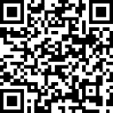

# PDFSecure 

A Windows application to securely lock and unlock PDF files with a password. 🚀

## Features
- **Lock a PDF**: Add a password to restrict access to your PDF.
- **Unlock a PDF**: Remove a password for unrestricted access.
- **Password Generator**: Generate strong passwords for your files.
- **AES-256 Encryption**: Uses **industry-standard AES-256 encryption** to secure your PDF files with robust protection.
- **User-friendly Interface**: Modern and intuitive design for effortless use.
- **Privacy Respect**: All password processing happens locally. **No passwords are stored**, ensuring complete confidentiality.
- **Standalone Desktop Application**: Works entirely on your computer, with no internet connection required.

## Security Warning ⚠️

Please note that the executable (`SecurePDF.exe`) and the file might be flagged as untrusted or unsafe by certain antivirus software or security systems. This is because the application is not signed with a recognized self-signed certificate.

However, the **full source code** is publicly available in this repository, and the application can be **compiled from source** to ensure its safety. If you're concerned about security, we recommend that you build the application yourself from the source code.

We take security seriously, and the entire codebase is visible and open for review. If you have any questions or concerns, feel free to reach out or submit an issue!

## Demo

## Technologies Used
Here are the main technologies used in this project:

  
  
  
  

## Getting Started

### Prerequisites
- **Operating System**: Windows 10 or higher
- **.NET Framework**: Version 4.7.2 or higher
- **Visual Studio**: For building the source code (optional)

### Installation
1. Navigate to [Releases Page](https://github.com/ninetiop/SecurePDF/releases/).
2. Download the `.exe` file.
3. Run the `PdfLocker.exe` file.

or 

1. Navigate to [Releases Page](https://github.com/ninetiop/SecurePDF/releases/) or clone the project.
2. Download the `.zip` file
3. Extract files.
3. Open `PdfLocker.sln` in Visual Studio.
4. Compile the project.
5. Run the .exe file built.

## How to Use
1. **Lock a PDF**:
    - Click on `Upload` to select a PDF file.
    - Generate or enter a password.
    - Choose an output location and click `Lock`.

2. **Unlock a PDF**:
    - Click on `Upload` to select a locked PDF.
    - Enter the correct password.
    - Choose an output location and click `Unlock`.
    
## Pay Me a Coffee ☕
Love the app? Consider supporting me!

 
 

 
 

## License
This project is licensed under the MIT License - see the [LICENSE](LICENSE) file for details.

---

